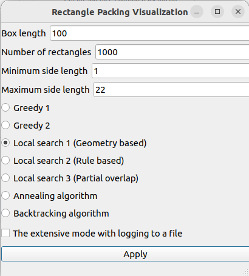
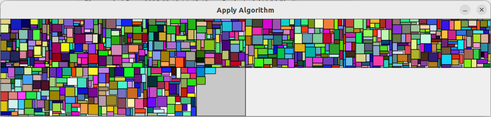

# Optimization Algorithms for Rectangle Packing

This project implements various optimization algorithms to solve the rectangle packing problem. The goal is to efficiently pack a set of rectangles into a minimal number of square boxes without overlap.

## Algorithms Implemented

- **Greedy Algorithms**:
  - `GreedyArea`: Sorts rectangles by area in descending order.
  - `GreedyPerimeter`: Sorts rectangles by perimeter in descending order.

- **Local Search Algorithms**:
  - `GeometryBasedNeighborhood`: Moves rectangles between boxes, swaps, and rotates them.
  - `RuleBasedNeighborhood`: Uses predefined rules to generate neighbors.
  - `PartialOverlapNeighborhood`: Allows partial overlaps initially and gradually reduces overlap tolerance.

- **Simulated Annealing**:
  - `SimulatedAnnealing`: Uses a probabilistic technique to approximate the global optimum.

- **Backtracking**:
  - `Backtracking`: Exhaustively searches for the optimal solution by exploring all possible placements.

- **TSP Problem**
  - `TSPProblem`: implements the idea behind TSP by using greedies and one local search.
## Usage

### Requirements

Install the required packages using:

```sh
pip install -r requirements.txt
```

### Running the Application

To run the main application with a GUI:

```sh
python src/main.py
```

### Example result
#### Main widnow
<p align="center">
  
</p>

#### The apply algorithm winodw
<p align="center">
  
</p>

### Running the Traveling Salesman Problem (TSP) Visualization

To run the TSP visualization demo:

```sh
python src/traveling_sales_man.py
```

### Logging Results

To run the algorithms in extensive mode with logging enabled, check the **"The extensive mode with logging to a file"** checkbox in the GUI.
The results will be logged in the `Logs` directory.

## File Descriptions

- **`src/algorithms.py`**: Contains the implementation of the `SimulatedAnnealing` and `Backtracking` algorithms.
- **`src/greedy.py`**: Contains the implementation of the greedy algorithms.
- **`src/local_search.py`**: Contains the implementation of the local search algorithms.
- **`src/main.py`**: Main entry point for the GUI application.
- **`src/scoring.py`**: Contains functions to compute various metrics for evaluating solutions.
- **`src/shelf_box.py`**: Contains the implementation of the `ShelfBox` class, a shelf-based packing algorithm.
- **`src/structs.py`**: Contains the core data structures used in the project, such as `OptimizationProblem`, `Box`, and `Rectangle`.
- **`src/traveling_sales_man.py`**: Contains the implementation and visualization of the Traveling Salesman Problem (TSP).
